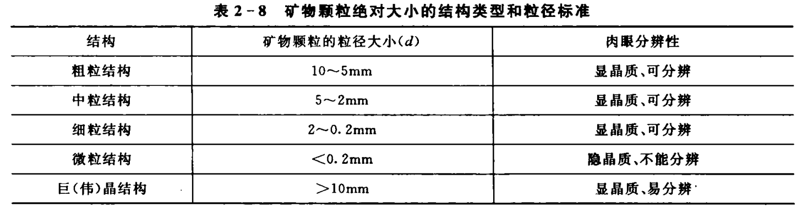

名称：亮甲山--砂锅店碳酸盐岩及岩溶地貌（8月4日）
路线4：基地—亮甲山—砂锅店—基地

任务：
1. 观察辉绿岩侵入体岩石特征，及其与周围岩石的关系；练习罗盘使用；绘制亮甲山岩层产状与辉绿岩侵入体产状图；
2. 观察亮甲山组与冶里组岩石分界，描述两组岩石特征；
3. 观察马家沟组与亮甲山组岩石分界，描述两组岩石特征；
4. 观察包气带岩溶地貌发育特征，分析影响因素。

---

| 组       | 符号                | 统       | 岩石及化石                                                   | 化石                                 |      |
| -------- | ------------------- | -------- | ------------------------------------------------------------ | ------------------------------------ | ---- |
| 马家沟组 | $O_2m$ （离现代近） | 中奥陶统 | 黄灰色、深灰色厚层白云质灰岩，含燧石结核豹皮状白云质灰岩，顶部为泥晶灰岩。 | 头足类、三叶虫、腹足类（多顶部灰岩） |      |
| 亮甲山组 | $O_1l$              | 下奥陶统 | 下部为深灰色中厚层含燧石结核云斑灰岩，夹少量砾屑灰岩和钙质页岩； 向上过渡为厚层生物碎屑灰岩与薄层泥灰岩互层，夹砾屑灰岩； 上部为灰色厚层含燧石结核条带灰岩、厚层豹皮状灰岩、中厚层云质条带灰岩，夹薄层云质条带灰岩。 | 头足类、腹足类、海绵                 |      |
| 冶里组   | $O_1y$              | 下奥陶统 | 下部为灰色中厚层泥晶灰岩，夹少量薄层砾屑及虫孔灰岩； 上部为灰色中厚层砾屑灰岩夹黄绿色页岩。 | 三叶虫、笔石、腹足类、腕足类         |      |

---

<h4>岩石厚度划分：</h4>

- `块状`   : >1m
- `厚层状` : 0.5 ~ 1m
- `中层状` : 0.1 ~ 0.5m
- `薄层状` : 0.01 ~ 0.1m
- `微层状` : < 0.01m

---

<h4>矿物颗粒</h4>

---

# 1. 地层界线观察点

---

## 2.2. 河流阶梯地貌

---

# 3. 岩溶地貌

## 发育的条件

1) 具有可溶性岩层
2) 足够的C02和水；
3) 地下水有下渗、流动的途径。

