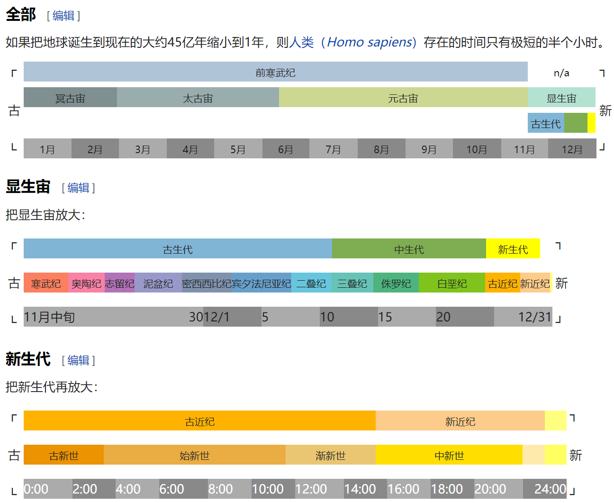
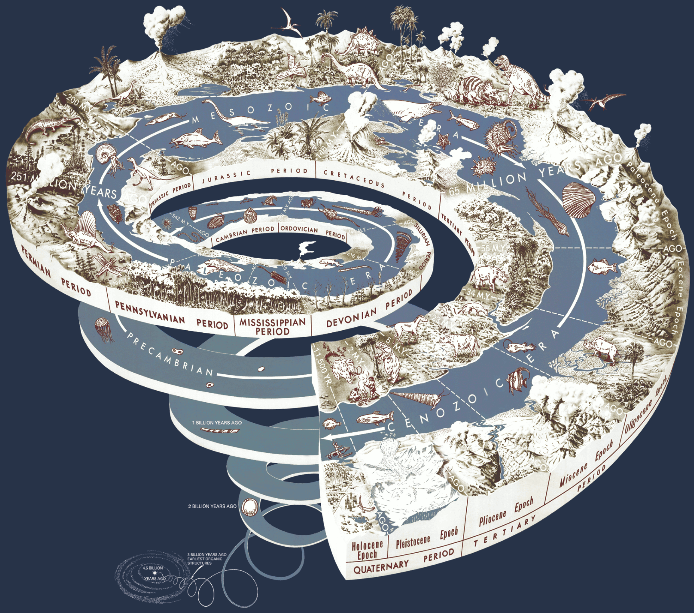

## 年代地层

年代地层是地质学中研究地层的学科。

地层是指地球上的不同岩石层序和沉积物的堆积序列，记录着地球历史上不同时期的地质过程。年代地层主要研究地层的形成、分布、顺序和相互关系，以及地球历史上的地质事件。通过研究年代地层，地质学家可以了解地球历史上的气候变化、生物演化、地质构造等方面的信息。年代地层的划分是根据岩石的类型、颜色、化石组合、矿物组成等特征来进行的。

## 地质年代

地质年代是地质时间尺度的一个单位，是对地球历史上不同时期的划分。地质年代是更大尺度的时间单位，通常包括数百万到数千万年的时间跨度。地质年代的划分是根据全球性的地质事件和生物演化等标志性特征来进行的。常见的地质年代包括白垩纪、寒武纪、古生代等。

---

# 地质纪年

**表1. [地质年代学](https://zh.wikipedia.org/wiki/地质年代学)和[地层学](https://zh.wikipedia.org/wiki/地层学)单位**

| [年代地层](https://zh.wikipedia.org/wiki/地层学) |     [地质年代](https://zh.wikipedia.org/wiki/地质年代学)     |           说明           |
| :----------------------------------------------: | :----------------------------------------------------------: | :----------------------: |
|  [宇](https://zh.wikipedia.org/wiki/宇_(地层))   |                      宙 (Eon, /ˈiːən/)                       |    共有4个，大于5亿年    |
|  [界](https://zh.wikipedia.org/wiki/界_(地层))   | [代](https://zh.wikipedia.org/wiki/代_(地质学)) (Era, /ˈɪrə*/*) |     共有14个，数亿年     |
|  [系](https://zh.wikipedia.org/wiki/系_(地层))   |   [纪](https://zh.wikipedia.org/wiki/纪_(地质学)) (Period)   | 共有22个，数千万至数亿年 |
|  [统](https://zh.wikipedia.org/wiki/统_(地层))   |   [世](https://zh.wikipedia.org/wiki/世_(地质学)) (Epoch)    |    共有34个，数千万年    |
|  [阶](https://zh.wikipedia.org/wiki/阶_(地层))   |  [期](https://zh.wikipedia.org/wiki/期_(地质学)) (subepoch)  |    共有99个，数百万年    |

**表2. 地质纪年**

| 地质纪年 | 英文名称      | 生物特征                                       | 地质特征                                         | 开始时间(Ma) | 结束时间(Ma) |
| -------- | ------------- | ---------------------------------------------- | ------------------------------------------------ | -------------- | -------------- |
| 第四纪   | Quaternary    | 人类的出现                                     | 冰河和间冰期交替，形成冰川沉积和冰碛岩           | 2.588 | 至今           |
| 新近纪   | Neogene       | 现代哺乳动物和鸟类的出现                       | 陆地和海洋环境的巨大变化，形成多样的岩石类型     | 23.03 | 2.588 |
| 古新世   | Paleogene     | 哺乳动物的进一步繁荣                           | 大规模的地壳运动和火山活动，形成盆地和火山岩     | 66    | 23.03 |
| 白垩纪   | Cretaceous    | 鸟类和哺乳动物开始出现                         | 大规模的海平面变化，形成大规模的白垩纪岩层       | 145   | 66    |
| 侏罗纪   | Jurassic      | 恐龙成为陆地生态系统的主导物种                 | 大规模的火山活动和构造运动继续，形成岩浆岩和断层 | 201   | 145   |
| 三叠纪   | Triassic      | 恐龙和爬行动物繁荣                             | 大规模的火山活动和构造运动，形成裂谷和火山岩     | 252   | 201   |
| 二叠纪   | Permian       | 出现早期哺乳动物和爬行动物的多样化             | 干旱气候造成大规模干旱沙漠和盐碱地               | 298.9 | 252   |
| 石炭纪   | Carboniferous | 大规模爬行动物和昆虫出现                       | 出现广泛的淡水湖泊和河流，形成大规模煤炭层       | 358.9 | 298.9 |
| 泥盆纪   | Devonian      | 珊瑚、腕足类和鱼类繁荣                         | 陆地植被继续扩展，形成了煤炭和油页岩             | 419.2 | 358.9 |
| 志留纪   | Silurian      | 鱼类开始出现                                   | 大规模陆地植被出现，岩石中常见页岩和石灰岩       | 443.8 | 419.2 |
| 奥陶纪   | Ordovician    | 出现多种软体动物和无脊椎动物，首次出现节肢动物 | 海洋生物进一步演化，形成大规模珊瑚礁和腕足类化石 | 485.4 | 443.8 |
| 寒武纪   | Cambrian      | 大规模海洋生物化石层，出现多样化的硬壳生物     | 海洋中的硬壳生物迅速繁荣，形成广泛的矿物质沉积   | 541   | 485.4 |

> 地质年代：宙(Eon)、代(Era)、纪(period)、世(epoch)、期

**地址年代与生物类型**

http://www.hngtzy.com.cn/Console/Publish/Article/PublishNews/F268326C135F4C55A3FE78AA09B487AE/index.htm

**地质年代比例**（https://zh.wikipedia.org/zh-cn/%E5%9C%B0%E8%B4%A8%E5%B9%B4%E4%BB%A3）

