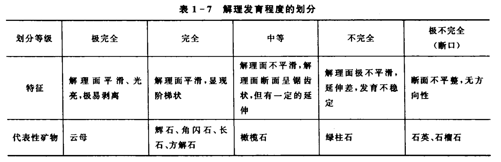
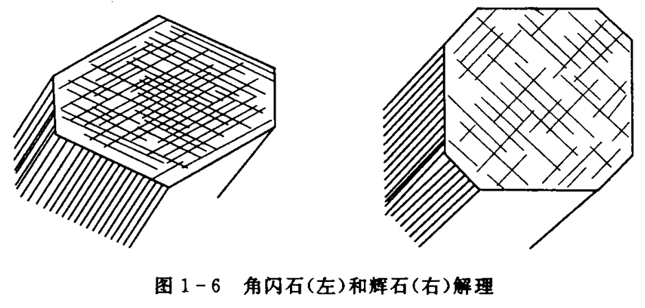
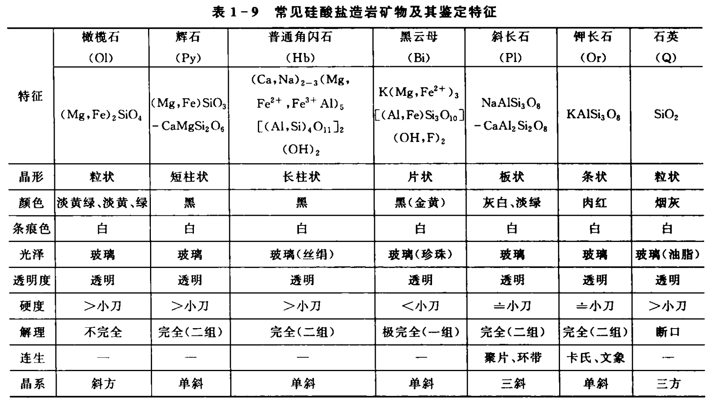
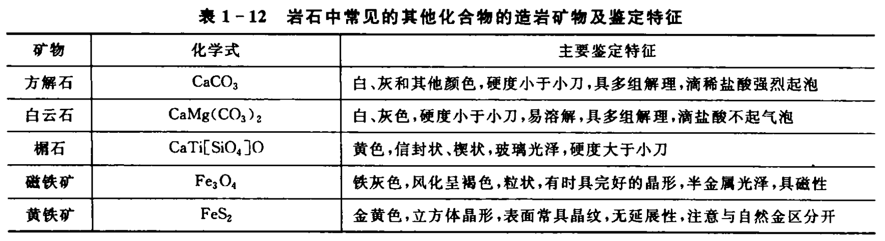
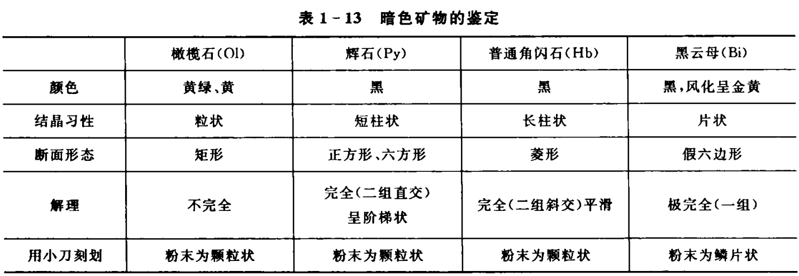
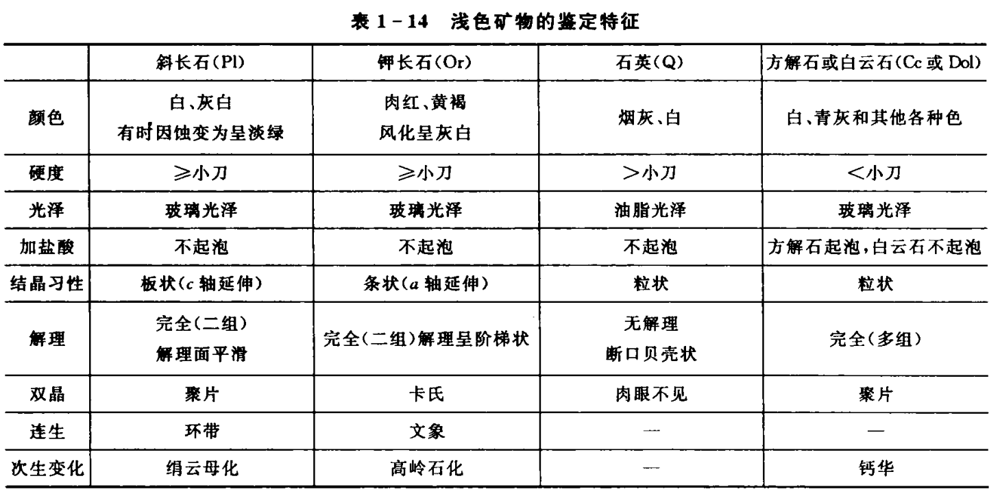
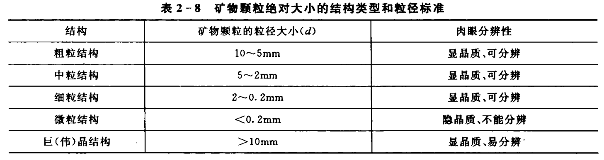
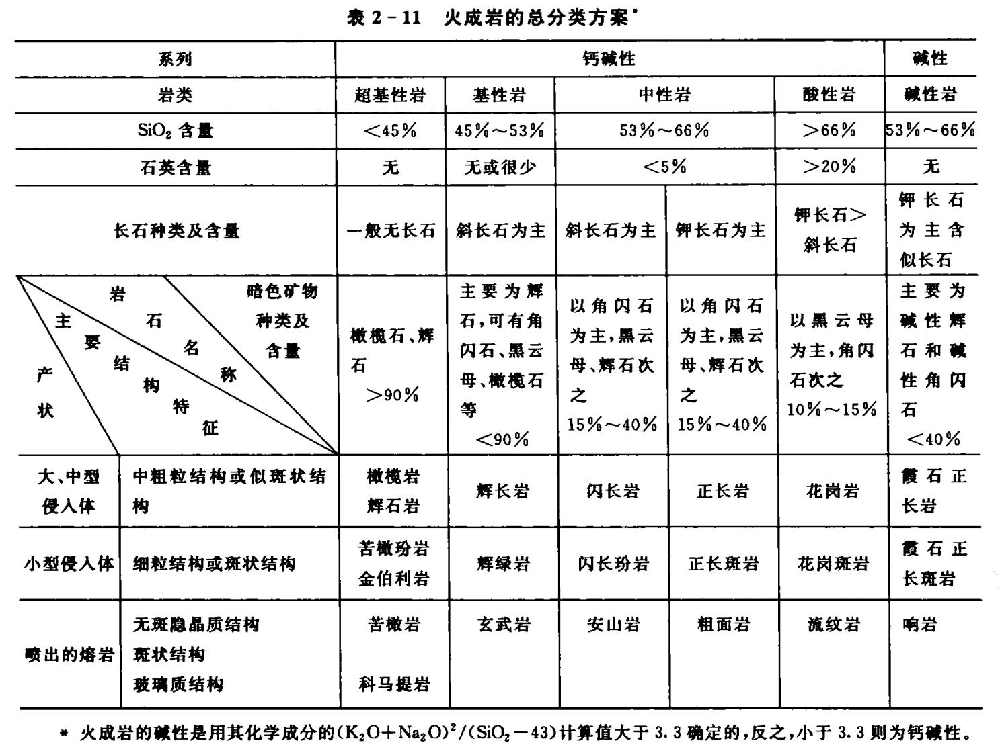
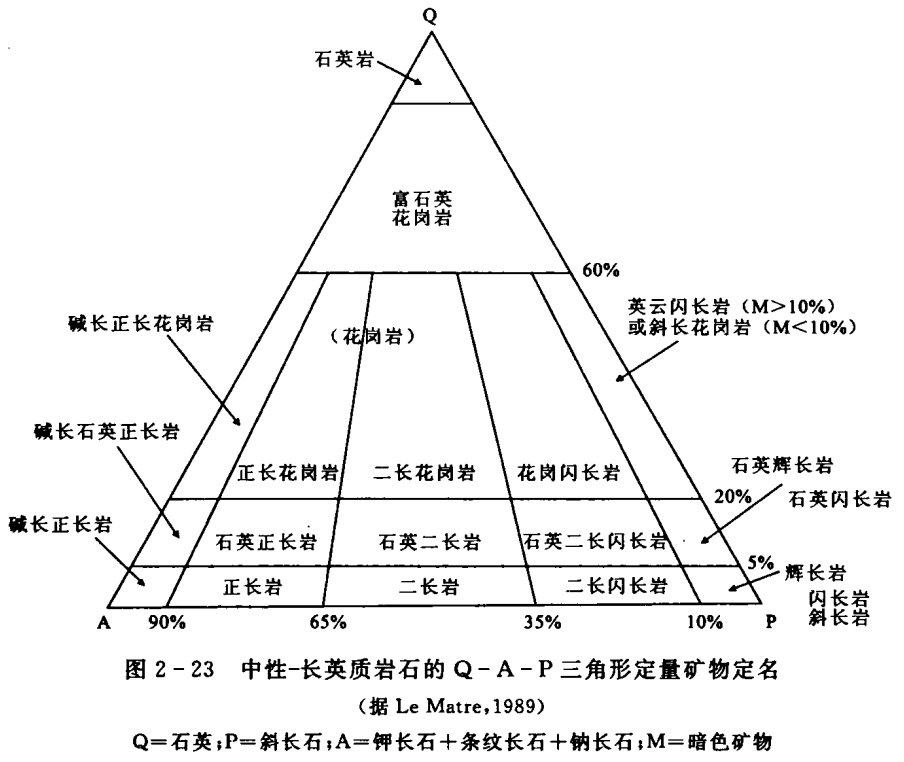

## 1. 晶体

双晶：2个或2个以上的同种晶体彼此间按一定的对称关系相互接合而成的**规则连生**体。

<u>**两晶体连生主要类型:**</u>

- 1. 两晶体相互穿插称为穿插双晶，如十字石的双晶；
- 2. 两晶体按一个面接触称为接触双晶，如石膏的双晶；
- 3. 两晶体相互咬合称为卡氏双晶，如钾长石的双晶；
- 4. 两个以上的晶体按接触面连续排列称为聚片双晶，如斜长石双晶。

### 1.1. 晶体的生长习性

(1) 一向延长

短柱状、长柱状、针状、纤维状、条状，<u>如辉石、角闪石、线石、蛇纹石、钾长石等</u>

(2) 二向延长

板状、片状、鳞片状，<u>如斜长石、绿泥石、黑云母等</u>

---

### 1.2. 解理发育等级

---

## 2. 基本矿物组成

---

### 2.1. 角闪石与辉石

- 角闪石：56°、124°
- 辉石: 88°、92°

---

### 2.2. 造岩矿物鉴定

---

### 2.3. 方解石与白云石

---

### 2.4. 暗色矿物

---

### 2.5. 浅色矿物

---

### 2.6. 矿物颗粒

---
## 3. 火成岩

### 3.1. 火成岩分类

---

### 3.2. 中性长英质

