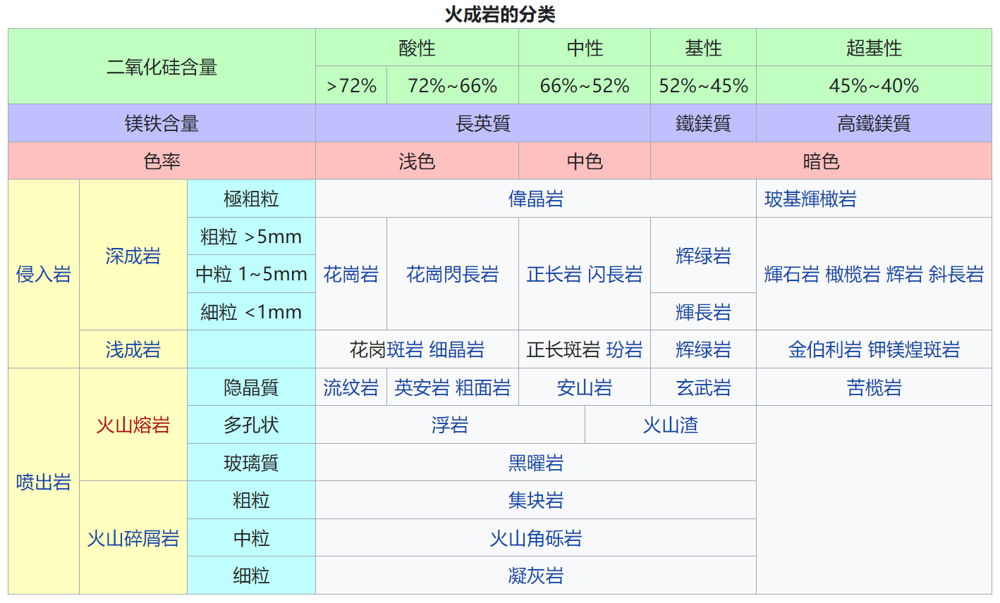
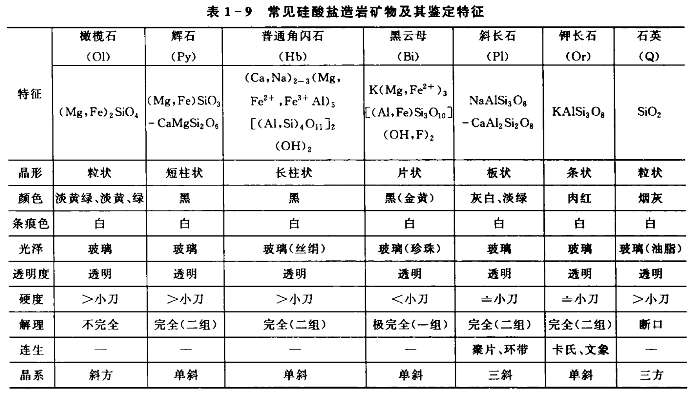

# 1. 岩石的类型

- **沉积岩**：主要由岩石风化后形成的碎屑物或水溶液中过饱和的物质沉积后固结而成。

- **岩浆岩**(火成岩)：地下岩浆到达地表或在地下某位置侵入冷凝固结而成。

  > 侵入岩、喷出岩

- **变质岩**：原有的岩石在温度、压力和化学活<u>动性流体</u>的作用下发生变质而成。

---

---

<h4>矿物颗粒</h4>

---

## 1.1. 岩浆岩

---

---

<h4>岩浆岩产状</h4>

> 产状：岩体的形态、大小、与周围岩石的关系、以及形成的地质构造环境

 

---

### 1.1.1. 中性长英质

---

# 2. 岩石的基本组成

---

## 2.1. 斑晶与晶体

双晶：2个或2个以上的同种晶体彼此间按一定的对称关系相互接合而成的**规则连生**体。

<u>**两晶体连生主要类型:**</u>

- 1. 两晶体相互穿插称为穿插双晶，如十字石的双晶；
- 2. 两晶体按一个面接触称为接触双晶，如石膏的双晶；
- 3. 两晶体相互咬合称为卡氏双晶，如钾长石的双晶；
- 4. 两个以上的晶体按接触面连续排列称为聚片双晶，如斜长石双晶。

### 2.1.1. 晶体的生长习性

(1) 一向延长

短柱状、长柱状、针状、纤维状、条状，<u>如辉石、角闪石、线石、蛇纹石、钾长石等</u>

(2) 二向延长

板状、片状、鳞片状，<u>如斜长石、绿泥石、黑云母等</u>

---

### 2.1.2. 七大晶系

---

---

---

### 2.1.3. 常见矿物的解理

| 矿物   | 解理         | 解理角度            | 晶系     |
| ------ | ------------ | ------------------- | -------- |
| 钾长石 | {001}和{010} | 90°；89°和91°       | 单斜晶系 |
| 斜长石 | {001}和{010} | 56°、124°；86°和94° | 单斜晶系 |
| 角闪石 | {001}和{110} | 56°和124°           | 单斜晶系 |
| 辉石   | {001}和{100} | 88°和92°            | 单斜晶系 |

---

<h4>斜长石的解理</h4>

---

### 2.1.4. 解理发育等级

---

## 2.2. 矿物成分

### 2.2.1. 造岩矿物鉴定

---

### 2.2.2. 暗色矿物

---

### 2.2.3. 浅色矿物

---

### 2.2.4. 混淆点区分

#### 2.2.4.1. 角闪石与辉石

- 角闪石：56°、124°
- 辉石: 88°、92°

---

#### 2.2.4.2. 方解石与白云石

