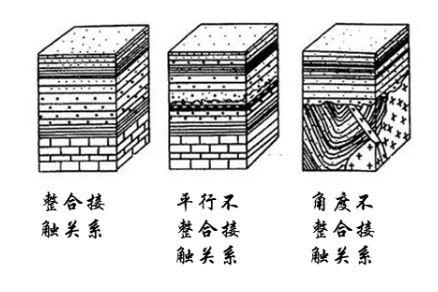

# 1. 接触关系

## 1.1. 整合接触

是指相邻的新老地层产状一致，他们的岩石性质与生物演化连续而渐变，沉积作用没有间断。表明该两套地层是连续沉积而成的。在其沉积期，该地区构造运动处于持续下降，或持续上升（如在水体中沉积，则上升时水体变浅，下降时水体变深）的状态。

> 地层连续，且下老上新

---

## 1.2. 平行不整合（假整合接触）

相邻的新老地层产状一致，它们的分界面是沉积作用的间断面，或称为剥蚀面。剥蚀面的产状与相邻的上、下地层的产状平行。剥蚀面是岩石遭受过风化剥蚀的表面，具有一定程度的起伏，故在凹下部位常常堆积有砾岩，称为底砾岩，其砾石来源于下伏岩层。

假整合接触表示较老的地层形成以后，地壳层均衡上升，使该地层遭受剥蚀，形成剥蚀面。随后地壳再均衡下降，在剥蚀面上重新接受沉积，形成上覆较新的地层。

---

## 1.3. 角度不整合接触

又称角度不整合接触。相邻的新、老地层产状不一致，其间有剥蚀面相分隔。剥蚀面的产状与上覆地层的产状一致，与下伏地层的产状不一致。不整合接触表示较老的地层形成后，因受强烈的构造作用而褶皱隆起并遭受剥蚀，形成剥蚀面，然后地壳下降，在剥蚀面上重新沉积，形成上覆的较新的地层。

应该指出，在假整合接触与不整合接触的形成过程中，沉积间断的时间是不均等的。有的较短，仅数百万年甚至更短，有的很长，可一个纪或几个纪，甚至更长。一般来说，凡不整合关系者，两相邻地层在岩性上及古生物化石组合上往往是突变的。

---

## 1.4. 侵入接触

是侵入体与被侵入围岩之间的接触关系。

<h4>侵入接触的主要标志是：</h4>

1. 侵入体与其围岩的接触带有接触变质现象;
2. 侵入体边缘常有捕掳体
3. 侵入体与其围岩的界线常呈不规则状。

> 侵入接触的存在说明该地区曾经发生过构造作用，因而引起了岩浆的侵入，形成了侵入体。侵入体的年代晚于被侵入围岩的年代。

<http://dzj.gd.gov.cn/kpg/dzkpkpzs/content/mpost_3980318.html>

---

# 2. 构造运动

---

## 2.1. 断层

节理：出现<u>裂缝</u>，但没有位移

断层：出现裂缝，有位移、错位

### 2.1.1. 上盘与下盘

- 上盘：断层面以上为上盘，平面与断层面的夹角为锐角。

- 下盘：断层面以下为下盘。

---

### 2.1.2. 正断层与逆断层

- 正断层：上盘下降、下盘上升
  > 张力作用下，断层面下滑形成，板块的生长边界

- 逆断层：上盘上升、下盘下降
  > 挤压作用下，断层面上升形成，板块的消亡边界；褶皱

- 平移断层：上盘与下盘平行滑动

断层 ，是多组断裂
