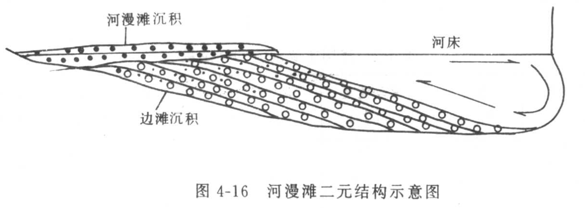
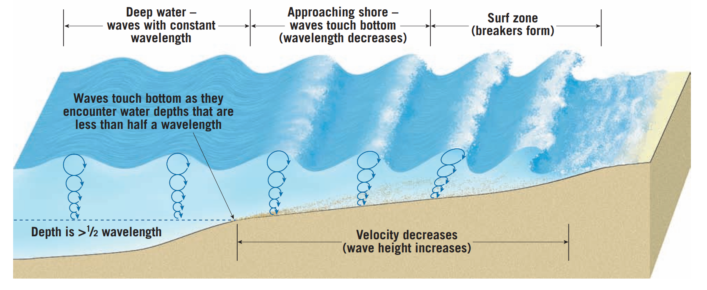

路线分布

向斜（）：石门寨

==如何连在一起看？==

## 0.1. 外动力

# 1. 风化

花岗岩

### 1.0.1. 影响因素

- 岩性
- 气候
- 植被
- 地形地貌

### 1.0.2. 风化的影响

1. 易溶物质流失
2. 水土流失、淤积
3. 
4. 岩石强度

土壤层、残积层、办分化层

# 2. 河流：河谷地貌、阶地

**a. 二元结构**

- 海洋：海蚀阶地

- 岩溶：
  $$
  CaCo3 + H_2O + CO_2 =
  $$

---

## 2.1. 内动力

- 地层–岩性及接触关系
- 构造–断层、地堑
- 岩浆作用–侵入岩、喷出岩

---

# 3. 海洋地质作用

- 浪迹面

波浪的运动特点

---

## 3.1. 波痕

干涉波痕

不对称波痕

---

## 3.2. 老虎石连岛沙坝

- 左右两侧砂质的变化

左侧颗粒粗，生物碎屑

---

高潮线

中潮线

低潮线

---

# 4. 岩溶

---

# 5. 地层及岩性

- 底砾岩

- 古风化壳--褐铁矿

牵引构造：向上的弧度

含水的原因

> 张性断裂、脆性岩石
